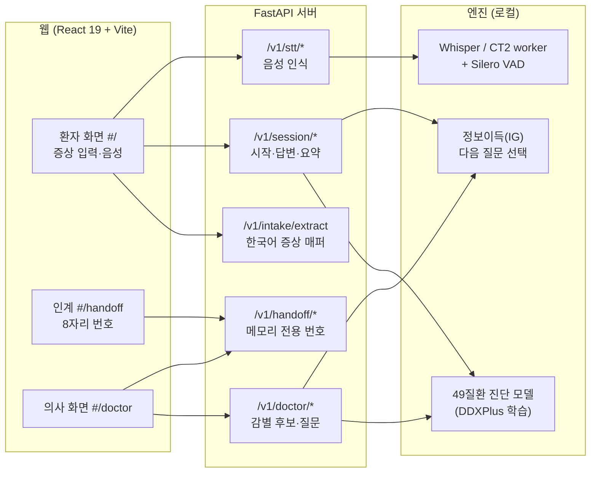
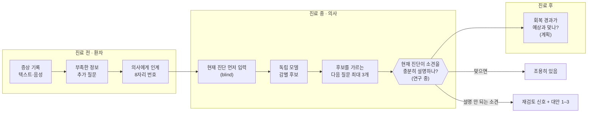
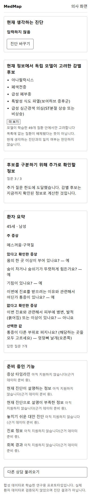
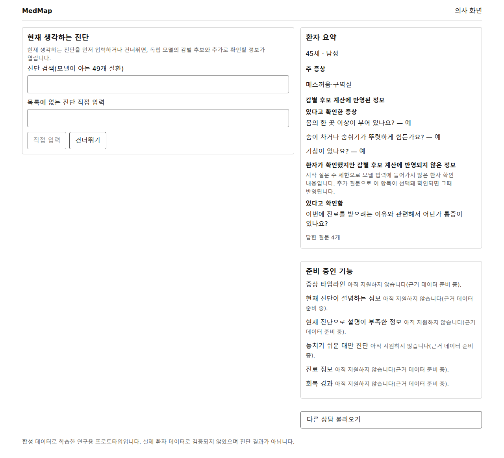

# MedMap — 의사용 진단 안전망 (Doctor-facing Diagnostic Safety Net)

> **환자가 말한 증상과 시간에 따른 변화를 모아 진료 전·중·후를 연결하고,
> 의사가 세운 현재 진단(Working Diagnosis)이 환자 소견을 계속 충분히 설명하는지 확인해,
> 설명되지 않는 소견이나 충돌이 있을 때에만 재검토를 돕는 의사용 진단 안전망.**

> ⚠️ **연구용 프로토타입입니다.** 합성 데이터(DDXPlus)로 학습했고 실제 환자 데이터로 검증하지 않았습니다. 진단 결과가 아니며 오진 감소나 임상 성능을 주장하지 않습니다.

**목차**: [문제 정의](#1-문제-정의와-동기) · [접근과 기여](#2-접근-방식과-기여) · [시스템 구조](#3-시스템-구조) · [화면](#4-화면) · [주차별 기록](#5-주차별-기록) · [연구 결과](#6-연구-결과) · [검증](#7-검증) · [한계와 향후 계획](#8-한계와-향후-계획) · [실행 방법](#9-실행-방법) · [용어](#10-용어) · [출처·라이선스](#11-참고-자료데이터-출처라이선스)

---

## 1. 문제 정의와 동기

### 1.1 배경과 필요성
- 진단 오류는 환자의 건강 문제를 정확하고 제때 설명하지 못하거나, 그 설명을 환자에게 전달하지 못하는 것으로 정의됩니다. 대부분의 사람이 일생에 한 번 이상 겪을 가능성이 높다고 보고됩니다[1].
- 규모:
  - 미국 외래 진료의 진단 오류율은 약 5.08 %로 추정되며, 매년 성인 약 1,200만 명에 해당합니다[2].
  - 진단 오류로 영구 장애를 입거나 사망하는 사람은 미국에서 연간 약 79만 5천 명으로 추정됩니다[3].
- 원인: 내과 진단 오류 100건을 분석한 연구에서 인지 요인이 74 %의 사례에 기여했습니다. 가장 흔한 단일 원인은 **초기 진단에 도달한 뒤 합리적인 대안을 계속 고려하지 않는 '조기 종결(premature closure)'**이었습니다[4].
- 기존 도구: 감별진단 생성 도구를 다룬 체계적 문헌고찰에서는 정확한 진단을 찾는 비율이 0.70이었지만, 임상의보다 나아지지는 않았습니다. 다만 도구를 본 뒤 **자신의 진단을 다시 검토할 기회**가 있었던 연구에서는 작은 개선이 관찰되었습니다. 연구 간 이질성이 커서 신중한 해석이 필요합니다[5].
- 따라서 MedMap은 질환 목록을 더 많이 보여 주기보다, **의사가 세운 현재 진단을 환자 소견과 대조해 다시 검토하도록 돕는 방향**이 필요하다고 봅니다. 이 문장은 [4][5]에서 도출한 이 프로젝트의 관점이며, 효과는 아직 검증하지 않았습니다.

### 1.2 무엇을 해결하려는가
| 시점 | 해결하려는 질문 | 현재 |
|---|---|---|
| **진료 중** | 의사가 지금 생각하는 진단으로 환자의 중요한 소견이 충분히 설명되는가? 설명되지 않거나 충돌하는 소견이 있으면 재검토를 돕는다 | 핵심 연구 과제(실험 설계 단계) |
| **진료 후** | 실제 회복 과정이 진료 당시 예상한 경과와 맞는가? | 계획(2차 연구) |

### 1.3 처음 아이디어에서 바뀐 이유
처음 구상은 "환자가 증상을 기록하면 AI가 관련 질환 후보와 질문을 보여 주는" 진단 보조였습니다. 이 방향은 제품으로는 의미가 있지만, 기존의 증상 기반 질환 추천·감별진단·질문 추천 시스템과 겹치는 부분이 많았습니다. 그래서 중심을 **"질병을 많이 알려 주는 시스템"에서 "현재 진단이 환자 정보와 계속 맞는지 확인하는 시스템"**으로 바꿨습니다.

### 1.4 사용 장면 (기획 문서의 가상 예시)
```text
환자(진료 전):  "배가 너무 아파요."  →  MedMap이 빠진 기본 정보를 질문 (언제부터? 어느 부위? 열·구토?)
의사(진료 중):  현재 진단 "장염" 입력
MedMap:        현재 진단으로 설명이 부족한 소견 → 반발통, 오른쪽 아랫배 국소 압통
               이 소견을 더 잘 설명하는 대안 1~3개, 진단과 대안을 가르는 다음 확인 정보 1개
맞는 진단이면:   조용히 있음
```
- 의사 화면이 목표로 하는 기능:
  - ① 확인된 정보
  - ② 아직 확인하지 않은 정보
  - ③ 현재 진단과 잘 맞지 않는 정보
  - ④ 필요할 때만 대안 1~3개
  - ⑤ 다음 확인 정보 추천(질문·진찰·검사)
- **현재 구현된 것은 ①과 ⑤의 질문 부분입니다.** ②는 "잘 모르겠다고 답한 질문"을 표시하는 데 그치고, ③④는 연구 중입니다.

### 1.5 연구 질문
- **RQ1**: 부분적으로 확인된 환자 정보로 세운 현재 진단이 틀렸을 때, 독립적인 의학 지식으로 이를 재검토 대상으로 구별할 수 있는가? 동시에 맞는 진단에는 불필요한 경고를 최소화하는가?
  - 첫 시도(STEP13B)는 NO_GO였습니다. 범위를 흉통 감별 부분집합으로 좁힌 재설계 실험(EXP-SN-001)을 사전등록하는 중입니다.
- **RQ2**: 재검토가 필요한 경우, 제한된 수(1~3개)의 추가 정보로 정답 진단을 얼마나 회복할 수 있는가?
  - 합성 데이터 내부 검증에서 GO였습니다(STEP16B).

### 1.6 평가 원칙
**"틀린 진단에는 경고하고, 맞는 진단에는 가능하면 조용히 있는다."** 그래서 정확도 하나로 평가하지 않습니다.
- 틀린 진단을 재검토 대상으로 잡는 비율
- 맞는 진단에서 괜히 경고하는 비율(오경보율)
- 고정한 낮은 오경보율(예: 10 %)에서의 탐지율
- AUROC
- 추가 정보 1개·3개 뒤의 정답 회복률
- 경고가 잦으면 실제 사용에서 무시되기 쉬우므로, 오경보율을 특히 중요하게 봅니다.

### 1.7 범위와 주장 한계
- 다루지 않는 것: 응급도 예측, 의료기관 추천, 실제 의사의 행동 변화, 실제 오진 감소. 한국어 STT 성능은 제품 기반 기능일 뿐 연구 주장이 아닙니다.
- **주장하지 않는 것**: 실제 의사의 오진을 줄였다, 환자 안전을 개선했다, 임상에서 효과가 있다. 이런 주장에는 실제 의사 대상 평가나 임상 연구가 필요합니다.

## 2. 접근 방식과 기여

| # | 기여 | 근거 |
|---|---|---|
| 1 | 외부 의학 지식으로 진단 오류를 잡는 방법을 사전등록 실험으로 검증. **잡히지 않는다(NO_GO)**는 부정 결과와 그 원인(지식 coverage, 정보 부족)을 공개 | 1주차 STEP13B |
| 2 | "다음에 무엇을 물을지"를 고르는 정보이득(IG) 질문 엔진 검증: 무작위 대비 크게 우세(GO, 합성 데이터) | 1주차 STEP16B |
| 3 | 환자 intake(자연어·음성) → 기기 간 인계 → 의사 화면을 오프라인·개인정보 비저장으로 구현하고 테스트 | `code/`, 2주차 |
| 4 | 다음 핵심 실험(진단 재검토 신호)의 사전등록 rev2: 진료지침 기반 범위, 판정 보류(abstention), 출처 라이선스 감사 | 2주차 `research/` |

## 3. 시스템 구조



### 제품 흐름 (기획)



### 단계(로드맵)
| 단계 | 내용 | 상태 |
|---|---|---|
| Foundation | 의사 화면 · blind 진단 입력 · 확률 없는 감별 후보 · 의사가 답하는 질문 루프 | ✅ 구현 |
| A. 인계 | 환자 기기 → 진료실 기기 인계(8자리·15분·1회용·메모리만) | ✅ 일부(영속 저장은 보류) |
| D. 질환 지식층 | 질환별 소견을 출처·사람 검수와 함께 정리 | 📝 설계만(검수자·출처 허가 필요) |
| E–I. 진단 검증 | 진단 검증 · 설명 범위 · 미설명 소견 · 놓친 대안 | 🔬 작은 범위 실험 사전등록 중(EXP-SN-001) |
| B·K·L–N | 증상 타임라인 · 진단 전환점 · 회복 경과 | ⏸ 보류(환자 정보 저장 금지 원칙) |

## 4. 화면

| 환자: 인계 번호 | 의사: 감별 후보와 다음 질문 | 의사: 환자 확인 소견 전체 표시 |
|---|---|---|
|  |  |  |

**데모 시나리오**: ① 휴대폰에서 증상 입력·확인 → ② "다른 기기(진료실)로 보내기"로 8자리 번호 받기 → ③ PC 의사 화면에서 번호 입력 → ④ 현재 진단을 먼저 입력(또는 건너뛰기) → ⑤ 감별 후보와 다음 질문 확인 → ⑥ 환자가 확인한 소견 전체 확인

> 참고: `qa_screenshots/06_patient_end_390.png`은 **수정 전** 환자 화면입니다(질환명·확률이 보이던 상태). 이후 환자 화면에서는 진단 후보와 확률을 모두 숨겼습니다.

## 5. 주차별 기록

| 주차 | 기간 | 핵심 | 폴더 |
|---|---|---|---|
| 1주차 | 2026-09-21 ~ 09-27 | 연구(외부 지식 검증 → 다음 질문 엔진) → 엔진·API·웹 → 자연어 intake · 음성 · 요약 · 한국어화 | [`week01_2026-09-21_to_09-27/`](week01_2026-09-21_to_09-27/) |
| 2주차 | 2026-09-28 ~ 10-04 | 제품 방향 재정의(의사용) → 의사 화면 · 실시간 음성 · 인계 · 통합 QA → v5 재정렬 · 핵심 실험 설계 | [`week02_2026-09-28_to_10-04/`](week02_2026-09-28_to_10-04/) |

## 6. 연구 결과

| 실험 | 결과 | 의미 | 의미가 **아닌** 것 |
|---|---|---|---|
| STEP13B 외부 지식 verifier | **NO_GO** (AUROC 0.478, 판정 가능 오답 23.3 %) | 외부 지식 + 단순 점수로 모델 오답을 잡는 신호 없음 | "외부 지식은 쓸모없다"(coverage·표현 문제로 미검증) |
| STEP16B 다음 질문 엔진(IG) | **GO** (1문항 회복률 0.459 vs 무작위 0.053) | 합성 환자 내부 holdout에서 모델 1위 오답이 IG 질문 1개로 정답 회복 | 의사 오진 탐지 · 임상 검증 · 무작위 외 다른 방법과의 비교(IG 표와 평가가 같은 시뮬레이터) |
| STEP17A 시작 상태 | **GO** | 자연어 intake 방식을 모사한 시작 상태(합성 환자)에서도 레시피 유지 | 실제 사용자 자연어 정확도 |
| 증상 매퍼 v1.2 (blind v3) | **제품 후보** (정밀도 0.963 기준 통과) | 한국어 증상 문장 → 질문 후보 | 재현율은 0.61로 기준 미달 |
| EXP-SN-001 흉통 Safety Net | 사전등록 rev2 · **실행 전** | 진단 재검토 신호의 최소 검증 설계 | — |

## 7. 검증

| 항목 | 결과 | 기준 |
|---|---|---|
| 백엔드 테스트 | 404개 통과(6개 건너뜀: 실제 Whisper·GPU 필요) | 이 저장소 그대로, `npm run build` 후 실행 |
| 프런트 테스트 | 293/293 통과 · 빌드 성공 | 이 저장소 그대로 |
| 실서버 e2e | 텍스트 intake · 흐름 · 요약 · 화면 영어 노출 0 · 의사 화면 · 인계 번호 | 개발 환경(원본 저장소 커밋 `fb2d7f0`) |
| 음성·실시간 STT | 음성 e2e 통과 · 실시간 자막 p95 465 ms(목표 ≤ 600) · 성능 회귀 없음 | 개발 환경 GPU, 합성 한국어 음성(`08cbbd3`) |
| 오프라인 | 네트워크 차단 상태에서 외부 연결 시도 0 | 개발 환경 |

> 커밋 해시(`fb2d7f0`, `08cbbd3`)는 원본 개발 저장소의 커밋이며, 이 공개 저장소에는 그 이력이 포함되어 있지 않습니다.

## 8. 한계와 향후 계획

**한계**
- 합성 데이터만 사용했습니다. 실제 환자, 실제 의사의 진단, 임상의 검수가 모두 없습니다.
- 진단 검증·설명 범위·미설명 소견·놓친 대안 기능은 미구현·미검증입니다.
- 진료지침상 **병력만으로 완전히 구별되는 흉통 감별쌍이 없습니다.** 대부분 심전도·트로포닌·영상 검사가 필요합니다.
- 말 끝 자동 감지 지연(p95 약 625 ms)이 목표 500 ms에 미달합니다. 실제 사람 녹음으로 기준값을 정해야 합니다.
- 확인한 진료지침 출처 중 소프트웨어·AI 사용을 명시적으로 허락한 곳이 없어, 질환 지식 작성 전에 허가가 필요합니다.

**향후 계획**
1. 출처 허가와 지식 작성 주체를 정한 뒤 EXP-SN-001 재심사
2. 흉통 감별 부분집합에서 "재검토 신호 대 모델 확신도 기준선" 1회 평가
3. 성공할 때에만 의사 화면 경고 기능과 다음 정보 추천 확장

## 9. 실행 방법

필요 환경: Python 3.12, Node.js 22 이상(개발 환경 v24). 서버 실행에 필요한 질문 사전과 모델 파일은 저장소에 들어 있습니다.

```bash
cd MedMap/code

# 1) 백엔드
python -m venv .venv && source .venv/bin/activate
pip install -r requirements-api.txt
python -m uvicorn medmap.api:app --port 8000        # http://127.0.0.1:8000/health → engine_ready: true

# 2) 프런트 (다른 터미널, 개발 서버가 /v1 을 8000번으로 프록시)
cd MedMap/code/medmap-web
npm install
npm run dev                                          # http://127.0.0.1:5173

# 3) 테스트
npm run build && npx vitest run                      # 프런트
cd .. && python -m unittest discover -s tests        # 백엔드 (dist 가 있어야 데모 스크립트 테스트 통과)
```

- 의사 화면: `http://127.0.0.1:5173/#/doctor`. 인계 번호를 쓰려면 서버를 `MEDMAP_HANDOFF_CODES=1`로 켭니다.
- 음성 입력에는 로컬 Whisper 모델이 필요합니다(오프라인). 실시간 STT worker는 별도 환경이 필요해 기본으로는 꺼져 있습니다.
- e2e 스크립트(`medmap-web/e2e/`)는 Playwright가 필요합니다(`npm i -D playwright && npx playwright install chromium`).
- **모델 다시 만들기(선택)**:
  1. `code/scripts/download_public.sh`로 DDXPlus를 `code/data/`에 받습니다.
  2. `week01_.../experiments/step16b_next_information_validation/`에서 `MEDMAP_ROOT=<MedMap/code 경로> python s16b_prepare.py`를 실행합니다.
  3. 생성된 `model_k*.pkl`과 `ig_table_step16b_train.npz`를 `code/exp/step16b_next_information_validation/`로 옮깁니다.

## 10. 용어

| 용어 | 뜻 |
|---|---|
| WD(Working Diagnosis) | 의사가 현재 세운 진단 |
| blind 입력 | 의사가 진단을 먼저 입력(또는 건너뛰기)해야 모델 후보가 보이는 방식. 모델에 판단이 끌려가지 않게 함 |
| IG(정보이득) | 어떤 질문의 답이 후보 질환 분포를 얼마나 바꾸는지의 기대값. 다음 질문 선택에 씀 |
| exact-k3 시작 | 초기 증상 1개 + 추가 관측 정확히 3개로 상담을 시작하는 규칙(검증된 모델 입력 형태) |
| intake / companion | 환자 쪽 기능. 의사에게 정보를 공급하는 역할 |
| holdout / 사전등록 | 평가 전용으로 떼어 둔 데이터 / 결과를 보기 전에 가설·지표·판정 기준을 고정하는 것 |
| AUROC | 두 집단(예: 맞음·틀림)을 점수로 구별하는 능력(0.5 = 우연) |
| reachable | 지식으로 판정이 가능한 사례 |
| abstention(판정 보류) | "검사가 필요함", "현재 범위 밖"처럼 판정하지 않는 정상 출력 |
| p95 / T_partial | 95번째 백분위 지연 / 말하는 중 자막이 화면에 뜨기까지 걸린 시간 |
| VAD / CT2 | 음성 구간 감지 / CTranslate2 기반 Whisper 실행 엔진 |
| e2e | 실제 서버와 브라우저로 처음부터 끝까지 확인하는 테스트 |
| PHI | 개인 건강 정보 |
| M1–M6 | 실시간 음성 단계(M1 자막 지연, M2 말 끝 감지, M4 후보 미리 준비, M5 의사 화면 응답, M6 성능 회귀 검사) |
| 판정어 | GO = 기준 충족 · NO_GO = 미충족 · PASS = 검사 통과 · BLOCK = 실행 전 심사에서 보류 |
| G0–G4 / Δ_safe | EXP-SN-001의 사전 판정 기준 / 고위험 층에서 허용하는 성능 저하 폭 |

## 11. 참고 자료·데이터 출처·라이선스

**배경 문헌**(§1.1, 수치는 초록 또는 보고서 원문에서 확인)
1. National Academies of Sciences, Engineering, and Medicine. *Improving Diagnosis in Health Care.* National Academies Press; 2015. https://nap.nationalacademies.org/catalog/21794
2. Singh H, Meyer AND, Thomas EJ. The frequency of diagnostic errors in outpatient care: estimations from three large observational studies involving US adult populations. *BMJ Qual Saf.* 2014;23(9):727-31. doi:10.1136/bmjqs-2013-002627
3. Newman-Toker DE, Nassery N, Schaffer AC, et al. Burden of serious harms from diagnostic error in the USA. *BMJ Qual Saf.* 2024;33(2):109-120. doi:10.1136/bmjqs-2021-014130
4. Graber ML, Franklin N, Gordon R. Diagnostic error in internal medicine. *Arch Intern Med.* 2005;165(13):1493-9. doi:10.1001/archinte.165.13.1493
5. Riches N, Panagioti M, Alam R, et al. The Effectiveness of Electronic Differential Diagnoses (DDX) Generators: A Systematic Review and Meta-Analysis. *PLoS One.* 2016;11(3):e0148991. doi:10.1371/journal.pone.0148991

**데이터·도구**

- **DDXPlus**: Fansi Tchango A., Goel R., Wen Z., Martel J., Ghosn J. *DDXPlus: A New Dataset for Automatic Medical Diagnosis.* NeurIPS 2022 Datasets and Benchmarks Track. 데이터: figshare, doi:10.6084/m9.figshare.20043374, **CC BY 4.0**.
  - 이 저장소는 DDXPlus의 질문 사전(`code/data/ddxplus/en/release_evidences.json`, 원본 그대로)을 포함합니다.
  - 질문·질환명은 **한국어로 번역·변형**해 사용했습니다(`code/medmap/data/`, `code/medmap/intake/`). 학습 모델(`code/exp/step16b_*`)은 DDXPlus 학습 데이터로 만들었습니다.
- **음성**: OpenAI Whisper(Radford et al., 2022, *Robust Speech Recognition via Large-Scale Weak Supervision*, MIT) · faster-whisper / CTranslate2(MIT) · Silero VAD(MIT). 모델 가중치는 포함하지 않았습니다.
- **연구 단계에서 사용한 외부 자료**(가공 결과는 포함하지 않고 수집·분석 스크립트만 포함):
  - Human Phenotype Ontology(hpo.jax.org)
  - HSDN(Zhou X. et al., *Human symptoms–disease network*, Nat Commun 2014)
  - OptimusKG(Harvard Dataverse doi:10.7910/DVN/IYNGEV, MIT)
  - Hetionet(MEDLINE 동시출현)
  - Wikidata
  - UMLS / SNOMED CT: 라이선스상 원자료·파생 데이터를 포함하지 않습니다.
- **진료지침**: 2021 AHA/ACC 흉통 평가·진단 지침(Gulati et al., Circulation 2021;144:e368), NICE CG95, 2023 ESC ACS 지침 등. 서지 정보·위치와 짧은 인용만 있고 원문은 포함하지 않습니다(2주차 `research/EXP-SN-001-literature-review.md`).
- 저작권이 있는 출처의 원문 인용을 모은 질환 프로필 스크립트 2개는 제외했습니다(1주차 README).
- 주차 폴더의 `design/` 문서는 `code/docs/` 원본을 작성 주차별로 모은 사본입니다.
- 이 저장소의 코드 라이선스는 아직 정하지 않았습니다.

---

작성: [jammi123852](https://github.com/jammi123852)
